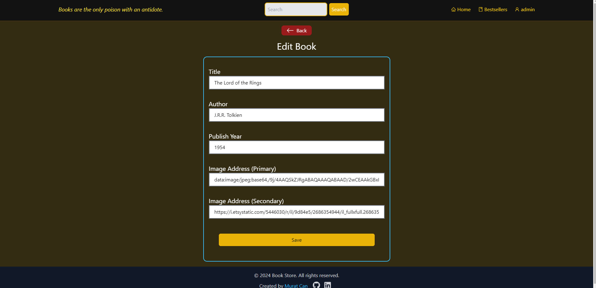
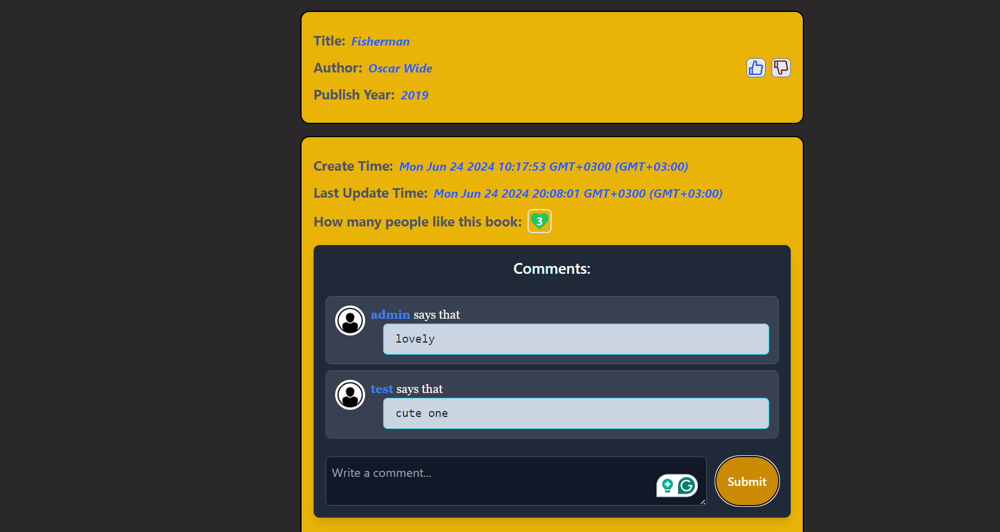

# MERN Bookstore

## Overview

This project implements a simple Bookstore application using the MERN stack (MongoDB, Express, React, Node.js). It provides functionalities to manage a collection of books where only admins can perform CRUD operations.

## Features

- Admin authentication to access CRUD operations.
- Create, update, and delete books in the bookstore.
- Any users can search books from the admin's own picks and can rate and leave comments.
- Search functionality to find books based on specific criteria.
- Displaying data fetched from MongoDB.

## Setup Instructions

To run this project locally, follow these steps:

1. Clone the repository: But do not forget to set ur own mongoDbUrl/..pass..

## Used Tools
- React Components and Props
- useState Hook
- Router (react-router-dom )
-Context API (useContext Hook)
- useEffect Hook
- Tailwind CSS
- Axios

